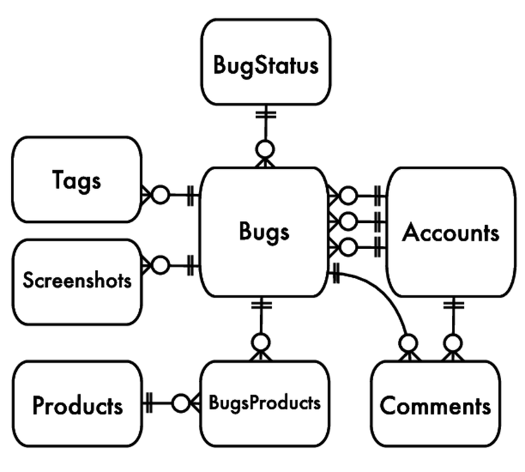

# Chapter 2. 무단횡단

****

<aside>
💡 각 값은 자신의 칼럼과 행에 저장하라

</aside>

## 1. 목표: 다중 값 속성 저장

---



- 테이블의 칼럼이 하나의 값을 가질 땐 설계가 쉽다. 해당 값의 인스턴스 하나를 표현하는 SQL 데이터 타입을 선택할 수 있다. 👉 제품과 계정은 다대일 관계
    - ex> 정수, 날짜, 문자열 같은 것
    
    ```sql
    CREATE TABLE Products (
      product_id   SERIAL PRIMARY KEY,
      product_name VARCHAR(1000),
      account_id   BIGINT UNSIGNED,
      FOREIGN KEY (account_id) REFERENCES Accounts(account_id)
    );
    
    CREATE TABLE Accounts (
      account_id     SERIAL PRIMARY KEY,
      account_name   VARCHAR(20),
      first_name     VARCHAR(20),
      last_name      VARCHAR(20),
      email          VARCHAR(100),
      password_hash  CHAR(64),
      portrait_image BLOB,
      hourly_rate    NUMERIC(9,2)
    );
    
    INSERT INTO Accounts (account_id, account_name)
    VALUES (12, 'account1');
    
    INSERT INTO Products (product_id, product_name, account_id)
    VALUES (DEFAULT, 'Visual TurboBuilder', 12);
    ```
    
- 제품의 담당자가 여러 명일 수도 있다.

## 2. 안티패턴: 쉼표로 구분된 목록에 저장

---

- 데이터베이스 구조의 변경을 최소화하기 위해, account_id 칼럼을 `VARCHAR`로 바꾸고 여기에 여러 개의 계정 아이디를 쉼표로 구분해 나열하기로 했다.
    
    ```sql
    create TABLE Products2 (
      product_id   SERIAL PRIMARY KEY,
      product_name VARCHAR(1000),
      account_id   VARCHAR(100) -- comma-separated list
    );
    
    INSERT INTO Products2 (product_id, product_name, account_id)
    VALUES (DEFAULT, 'Visual TurboBuilder', '12,34');
    ```
    

### 이 테이블 설계로부터 겪어야 할 성능 문제와 데이터 정합성 문제

---

- 특정 계정에 대한 제품 조회
    - 모든 FK 가 하나의 필드에 결합되어 있으면 쿼리가 어려워진다. 더 이상 같은지를 비교할 수 없다.
    - 어떤 [패턴](https://dev.mysql.com/doc/refman/8.0/en/regexp.html#operator_regexp)에 맞는지를 검사해야 한다.
        
        ```sql
        SELECT * FROM Products2 WHERE account_id REGEXP '[[:<:]]' || 12 || '[[:>:]]';
        ```
        
    - 😰 패턴 매칭을 사용하면 잘못된 결과가 리턴될 수도 있고 인덱스도 활용하지 못한다.
    - 😰 벤더 중립적이지도 않다.
- 주어진 제품에 대한 계정 정보 조회
    - 쉼표로 구분된 목록을 참조하는 테이블의 대응되는 행과 조인하기도 불편해지고 비용이 많이 든다.
        
        ```sql
        SELECT *
          FROM Products2 AS p
          JOIN Accounts AS a
            ON p.account_id REGEXP '[[:<:]]' || a.account_id || '[[:>:]]'
         WHERE p.product_id = 123;
        ```
        
    - 😰 인덱스를 활용할 기회가 사라진다.
        - 두 테이블을 모두 읽어 카테시안 곱을 생성한 다음, 모든 행의 조합에 대해 정규 표현식을 평가해야 한다.
- 집계 쿼리 만들기
    - 집계 쿼리는 행의 그룹에 대해 사용하도록 설계되었지, 쉼표로 구분된 목록에 대해 사용하도록 설계된 것이 아니다.
        - `COUNT()`, `SUM()`, `AVG()`와 같은 함수
        
        ```sql
        SELECT product_id
             , LENGTH(account_id) - LENGTH(REPLACE(account_id, ',', '')) + 1
            AS contacts_per_product
          FROM Products2;
        +------------+----------------------+
        | product_id | contacts_per_product |
        +------------+----------------------+
        |          1 |                    2 |
        +------------+----------------------+
        ```
        
    - 😰 명확하지 않다.
    - 😰 개발하는 데 시간도 오래 걸리고 디버깅하기도 어렵다.
- 특정 제품에 대한 계정 갱신
    - 목록이 정렬된 상태로 유지되지 않는다.
        
        ```sql
        UPDATE Products
           SET account_id = account_id || ',' || 56
         WHERE product_id = 123;
        ```
        
    - 목록에서 항목을 삭제하려면 두 개의 SQL 쿼리를 실행해야 한다.
        
        ```php
        <?php
        
        $stmt = $pdo->query(
        // 1. 예전 목록을 불러옴
          "SELECT account_id FROM Products WHERE product_id = 123");
        $row = $stmt->fetch();
        $contact_list = $row['account_id'];
        
        // change list in PHP code
        $value_to_remove = "34";
        $contact_list = split(",", $contact_list);
        $key_to_remove = array_search($value_to_remove, $contact_list);
        unset($contact_list[$key_to_remove]);
        $contact_list = join(",", $contact_list);
        
        $stmt = $pdo->prepare(
        // 2. 목록을 갱신
          "UPDATE Products SET account_id = ?
           WHERE product_id = 123");
        $stmt->execute(array($contact_list));
        ```
        
    - 😰 많은 코드가 필요하다.
- 제품 아이디 유효성 검증
    - 유효하지 않은 항목을 입력
        
        ```sql
        INSERT INTO Products2 (product_id, product_name, account_id)
        VALUES (DEFAULT, 'Visual TurboBuilder', '12,34,banana');
        ```
        
    - 😰 데이터베이스에서 에러가 발생하지는 않지만, 데이터는 의미 없는 것이 될 것이다.
- 구분자 문자 선택
    - 문자열 목록을 저장하는 경우 목록의 일부 항목이 구분자 문자를 포함할 수 있다.
- 목록 길이 제한
    - 저장 👉 각 항목의 길이에 따라 다르다.
        
        ```sql
        UPDATE Products2
           SET account_id = '10,14,18,22,26,30,34,38,42,46'
         WHERE product_id = 123;
        
        UPDATE Products2
           SET account_id = '101418,222630,343842,467790'
         WHERE product_id = 123;
        ```
        

## 3. 안티패턴 인식 방법

---

### 무단횡단 안티패턴이 사용되고 있음을 나타내는 단서

---

- “이 목록이 지원해야 하는 최대 항목 수는 얼마나 될까?”
    
    → `VARCHAR` 칼럼의 최대 길이를 선정하려 할 때 질문
    
- “SQL 에서 단어의 경계를 어떻게 알아내는지 알아?”
    
    → 문자열 일부를 찾아내기 위해 정규 표현식을 사용한다면, 이런 부분을 별도로 저장해야 함을 뜻하는 단서!
    
- “이 목록에서 절대 나오지 않을 문자는?”
    
    → 모호하지 않은 문자를 구분자로 사용하고 싶겠지만, 어떤 구분자를 쓰든 언젠가는 그 문자가 목록의 값에 나타날 것
    

## 4. 안티패턴 사용이 합당한 경우

---

- 어떤 종류의 쿼리는 데이터베이스에 반정규화를 적용해 성능을 향상시킬 수 있다.
    - ex> 목록을 쉼표로 구분된 문자열로 저장하는 것
- 애플리케이션에서 쉼표로 구분된 형식의 데이터를 필요로 하고, 목록 안의 개별 항목에는 접근할 필요가 없을 수 있다.
- 데이터를 받아 데이터베이스에 그대로 저장하고 나중에 동일한 형식으로 불러내야 하며, 목록 안의 개별 값을 분리할 필요가 없다면.
- 👉 정규화하는 것이 먼저!
    - 애플리케이션 코드를 좀더 융통성 있게 하고, 데이터베이스의 정합성을 유지할 수 있게 한다.

## 5. 해법: 교차 테이블 생성

---

- 교차 테이블: 어떤 테이블이 FK로 두 테이블을 참조할 때. 참조되는 두 테이블 사이의 다대다 관계를 구현한다.
    
    ```sql
    CREATE TABLE Contacts (
      product_id  BIGINT UNSIGNED NOT NULL,
      account_id  BIGINT UNSIGNED NOT NULL,
      PRIMARY KEY (product_id, account_id),
      FOREIGN KEY (product_id) REFERENCES Products(product_id),
      FOREIGN KEY (account_id) REFERENCES Accounts(account_id)
    );
    
    INSERT INTO Contacts (product_id, account_id)
    VALUES (123, 12), (123, 34), (345, 23), (567, 12), (567, 34);
    ```
    

### 교차 테이블을 사용

---

- 계정으로 제품 조회하기와 제품으로 계정 조회하기
    
    ```sql
    -- productbyaccount
    SELECT p.*
      FROM Products AS p JOIN Contacts AS c ON (p.product_id = c.product_id)
     WHERE c.account_id = 34;
    
    -- accountbyproduct
    SELECT a.*
      FROM Accounts AS a JOIN Contacts AS c ON (a.account_id = c.account_id)
     WHERE c.product_id = 123;
    ```
    
    - 😃 효율적으로 인덱스를 사용한다.
- 집계 쿼리 만들기
    
    ```sql
    -- accountsperproduct
    SELECT product_id, COUNT(*) AS accounts_per_product
      FROM Contacts
     GROUP BY product_id;
    
    -- productsperaccount
    SELECT account_id, COUNT(*) AS products_per_account
      FROM Contacts
     GROUP BY account_id;
    
    -- productwithmaxaccounts
    SELECT c.product_id, c.contacts_per_product
      FROM (
        SELECT product_id, COUNT(*) AS accounts_per_product
          FROM Contacts
         GROUP BY product_id
      ) AS c
     ORDER BY c.contacts_per_product DESC
     LIMIT 1
    ```
    
    - 😃 간단하다. 좀더 복잡한 리포트를 만드는 것도 가능하다.
- 특정 제품에 대한 계정 갱신
    - 목록에 항목을 추가하거나 삭제하는 것은 교차 테이블에 행을 삽입하거나 삭제하는 방법으로 할 수 있다.
        
        ```sql
        INSERT INTO Contacts (product_id, account_id) VALUES (456, 34);
        
        DELETE FROM Contacts
         WHERE product_id = 456
           AND account_id = 34;
        ```
        
    - 😃 한 번에 하나씩 추가 또는 삭제할 수 있다.
- 제품 아이디 유효성 검증
    - 😃 FK → 참조 정합성을 데이터베이스가 강제하도록 할 수 있다.
    - 😃 SQL 데이터 타입 → 모든 항목이 해당 타입의 유효한 값
- 구분자 문자 선택
    - 각 항목을 별도의 행으로 저장하므로 구분자를 사용하지 않는다.
    - 😃 구분자 → 항목에 포함되어 있을지 걱정할 필요가 없다.
- 목록 길이 제한
    - 한 테이블에 물리적으로 저장할 수 있는 행 수에만 제한을 받는다.
    - 😃 항목 수를 제한 → 애플리케이션에서!
- 교차 테이블의 다른 장점
    - 😃 인덱스를 활용 → 성능이 좋아진다.
        - 칼럼에 FK 를 선언 → 내부적으로 해당 칼럼에 대한 인덱스를 생성한다.
    - 😃 교차 테이블에 칼럼을 추가해 각 항목에 추가 속성을 넣을 수 있다.

- 참고
    - [https://github.com/pravusid/TIL/blob/2636a636c1b43ba44199e68914c4c674cb172814/Database/sql-anti-patterns.md](https://github.com/pravusid/TIL/blob/2636a636c1b43ba44199e68914c4c674cb172814/Database/sql-anti-patterns.md)
    - [https://github.com/rewritech/til/blob/061e84726cb8a8f4efb0ebe09246c72b280bb6f7/SQL/SQL-antipatern-01논리.md](https://github.com/rewritech/til/blob/061e84726cb8a8f4efb0ebe09246c72b280bb6f7/SQL/SQL-antipatern-01%EB%85%BC%EB%A6%AC.md)
