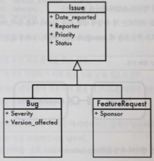

# Chapter 6. 엔터티-속성-값

## 1. 목표: 가변 속성 지원

---

- 일반적인 테이블은 테이블에 있는 모든 행과 관계된 속성 칼럼으로 이루어져 있고, 각 행은 비슷한 객체의 인스턴스를 나타낸다.
    - 속성 집합이 다르면 객체의 타입도 다르다는 뜻 → 다른 테이블에 있어야 한다.
- 현대 객체지향 프로그램은 모델에서는 동일한 데이터 타입을 확장(상속)하는 것과 같은 방법으로 객체의 타입도 관계를 가질 수 있다.
- 확장된 객체 정보를 테이블 행으로 저장하고 싶음
- 예제: 버그 데이터베이스
    
    
    
    - Issue: 모든 이슈는 이슈를 보고한 사람과 관계가 있음.이슈는 제품과도 관계가 있을 뿐 아니라 우선순위도 갖는다.
    - Bug: 버그가 발생한 제품의 버전과 버그의 중요도 또는 영향도와 같은 다른 속성을 가진다.
    - FeatureRequest: 자신만이 가지고 있는 스폰서 속성을 가진다.

## 2. 안티패턴: 범용 속성 테이블 사용

---

- 가변 속성을 지원해야 할 때 일부 개발자가 흥미를 갖는 방법은 별도 테이블을 생성해 속성을 행으로 저장하는 것이다.
- 이 속성 테이블의 각 행은 세 개의 칼럼을 갖는다.
    - 엔티티: 하나의 엔티티에 대해 하나의 행을 가지는 부모 테이블에 대한 FK 다.
    - 속성: 각 행마다 속성 하나씩 들어간다.
    - 값: 모든 엔티티는 각 속성에 대한 값을 가진다.
- 이 설계는 엔티티-속성-값(EAV)라 불린다.
    
    
    
    ```sql
    CREATE TABLE Issues (
      issue_id    SERIAL PRIMARY KEY
    );
    
    INSERT INTO Issues (issue_id) VALUES (1234);
    
    CREATE TABLE IssueAttributes (
      issue_id    BIGINT UNSIGNED NOT NULL,
      attr_name   VARCHAR(100) NOT NULL,
      attr_value  VARCHAR(100),
      PRIMARY KEY (issue_id, attr_name),
      FOREIGN KEY (issue_id) REFERENCES Issues(issue_id)
    );
    
    INSERT INTO IssueAttributes (issue_id, attr_name, attr_value)
    VALUES
        (1234, 'product',          '1'),
        (1234, 'date_reported',    '2009-06-01'),
        (1234, 'status',           'NEW'),
        (1234, 'description',      'Saving does not work'),
        (1234, 'reported_by',      'Bill'),
        (1234, 'version_affected', '1.0'),
        (1234, 'severity',         'loss of functionality'),
        (1234, 'priority',         'high');
    ```
    
- 별도 테이블을 추가해 얻은 이득을 얻은 것 같아 보인다.
    - 두 테이블 모두 적은 칼럼을 갖고 있다.
    - 새로운 속성을 지원하기 위해 칼럼 수를 늘릴 필요가 없다.
    - 특정 속성이 해당 행에 적용되지 않을 때 `NULL`을 채워야 하는 칼럼이 지저분하게 생기는 것을 피할 수 있다.

😰 그러나 데이터베이스 설계가 단순하다고 해서 사용하기 어려운 것을 보상해주지는 않는다.

### 속성 조회

---

- 매일 보고된 버그 리포트: 모든 버그와 보고일자를 조회
    - 일반적인 테이블 설계에서는
        - Issue 테이블이 date_reported 와 같은 간단한 속성을 가질 것이다.
        
        ```sql
        SELECT issue_id, date_reported FROM Issues;
        ```
        
    - EAV 설계를 사용할 때 👉 더 복잡하고 덜 명확하다.
        
        ```sql
        SELECT issue_id, attr_value AS "date_reported"
          FROM IssueAttributes
         WHERE attr_name = 'date_reported';
        +----------+---------------+
        | issue_id | date_reported |
        +----------+---------------+
        |     1234 | 2009-06-01    |
        +----------+---------------+
        ```
        

### 데이터 정합성 지원

---

- 필수 속성 사용 불가
    - 일반적인 데이터베이스 → 칼럼을 `NOT NULL`로 선언해 항상 값을 가지도록 강제할 수 있다.
    - 😰 그러나 SQL 은 이런 사항을 확인할 수 있는 제약조건은 지원하지 않는다.
    - 😰 이를 강제하는 애플리케이션 코드를 직접 작성해야 한다.
- SQL 데이터 타입 사용 불가
    - 일반적인 데이터베이스 → 칼럼의 데이터 타입을 `DATE` 로 선언해 이런 문제를 예방할 수 있다.
        
        ```sql
        INSERT INTO Issues (date_reported) VALUES ('banana'); -- ERROR
        ```
        
    - EAV 설계 → 가능한 모든 속성을 수용하기 위해 문자열 타입을 사용
        - 😵 유효하지 않은 값을 거부할 방법이 없다.
        
        ```sql
        INSERT INTO IssueAttributes (issue_id, attr_name, attr_value)
        VALUES (12345, 'date_reported', 'banana');
        Query OK, 1 row affected (0.00 sec)
        ```
        
    - EAV 확장 → 😰 데이터 타입을 사용할 수는 있게 되지만 쿼리는 훨씬 더 복잡해진다.
        
        ```sql
        SELECT issue_id, COALESCE(attr_value_date, attr_value_datetime,
               attr_value_integer, attr_value_numeric, attr_value_float,
               attr_value_string, attr_value_text) AS "date_reported"
          FROM IssueAttributes
         WHERE attr_name = 'date_reported';
        ```
        
- 참조 정합성 강제 불가
    - 일반적인 데이터베이스 → FK 를 정의해 특정 속성의 범위를 제한할 수 있다.
        
        ```sql
        CREATE TABLE Issues2 (
          issue_id         SERIAL PRIMARY KEY,
          -- other columns
          status           VARCHAR(20) NOT NULL DEFAULT 'NEW',
          FOREIGN KEY (status) REFERENCES BugStatus(status)
        );
        ```
        
    - EAV 설계 → 😰 status 속성 뿐 아니라 모든 속성이 BugStatus 에 있는 값과 매치되도록 강제하게 된다.
        
        ```sql
        CREATE TABLE IssueAttributes (
          issue_id         BIGINT UNSIGNED NOT NULL,
          attr_name        VARCHAR(100) NOT NULL,
          attr_value       VARCHAR(100),
          FOREIGN KEY (attr_value) REFERENCES BugStatus(status)
        );
        ```
        
        
        
    
    <aside>
    💡 참조 정합성 제약조건은 테이블의 모든 행에 적용된다.
    
    </aside>
    
- 속성 이름 강제 불가
    - 😰 속성 이름이 일관적이지 않다.
        - 어떤 버그는 date_reported, 어떤 버그는 report_date 란 이름의 속성을 사용
        
        ```sql
        SELECT sub.date_reported, COUNT(*) AS bugs_per_date
        FROM (SELECT DISTINCT issue_id, attr_value AS date_reported
              FROM IssueAttributes
              WHERE attr_name IN ('date_reported', 'report_date')) sub
        GROUP BY sub.date_reported;
        +---------------+---------------+
        | date_reported | bugs_per_date |
        +---------------+---------------+
        | 2009-06-01    |             1 |
        | banana        |             1 |
        +---------------+---------------+
        ```
        
        - 😵 날짜를 다른 이름의 속성으로 저장한 버그가 없다는 것을 어떻게 알 수 있을까?
    - 💡 attr_name 칼럼에 승인된 속성 이름만 저장하고 있는 색인 테이블에 대한 FK 를 선언!
        - 😰 아무 때고 엔터티에 속성을 추가하는 기능을 (EAV 의) 기능을 지원하지 못하게 된다.

### 행을 재구성하기

---

- 속성을 칼럼으로 조회
    - 일반적인 테이블 → 하나의 이슈를 하나의 행으로 꺼냄
    - EAV → 😰 행 하나의 일부로 속성을 꺼내기 위해서는 각 속성에 대한 조인이 필요하다.
        - 모든 속성의 이름을 알아야 한다.
        
        ```sql
        SELECT i.issue_id,
          i1.attr_value AS "date_reported",
          i2.attr_value AS "status",
          i3.attr_value AS "priority",
          i4.attr_value AS "description"
        FROM Issues AS i
          LEFT OUTER JOIN IssueAttributes AS i1
            ON i.issue_id = i1.issue_id AND i1.attr_name = 'date_reported'
          LEFT OUTER JOIN IssueAttributes AS i2
            ON i.issue_id = i2.issue_id AND i2.attr_name = 'status'
          LEFT OUTER JOIN IssueAttributes AS i3
            ON i.issue_id = i3.issue_id AND i3.attr_name = 'priority'
          LEFT OUTER JOIN IssueAttributes AS i4
            ON i.issue_id = i4.issue_id AND i4.attr_name = 'description'
        WHERE i.issue_id = 1234;
        +----------+---------------+--------+----------+----------------------+
        | issue_id | date_reported | status | priority | description          |
        +----------+---------------+--------+----------+----------------------+
        |     1234 | 2009-06-01    | NEW    | high     | Saving does not work |
        +----------+---------------+--------+----------+----------------------+
        ```
        
        - 내부 조인을 사용하면 IssueAttributes 에 속성이 하나라도 없는 경우 아무 것도 리턴되지 않을 수 있으므로 외부 조인을 사용해야 한다.
        - 😵 속성 개수가 늘어나면 조인 회수도 늘어나야 하고, 쿼리의 비용은 지수적으로 증가한다.

## 3. 안티패턴 인식 방법

---

### EAV 안티패턴을 사용하고 있다는 뜻

---

- “이 데이터베이스는 메타데이터 변경 없이 확장이 가능하지. 런타임에 새로운 속성을 정의할 수 있어.”
    
    → 관계형 데이터베이스는 이런 수준의 유연성을 제공하지 않는다.
    
- “하나의 쿼리에서 조인을 최대 몇 번이나 할 수 있지?”
    
    → 데이터베이스 한계를 넘어서는 것을 걱정할 정도로 조인 회수가 많은 쿼리가 필요하다면, 데이터베이스 설계에 문제가 있는 것이다.
    
- “우리 전자상거래 플랫폼에서는 리포트를 어떻게 생성해야 할지 이해할 수가 없어. 아무래도 컨설턴트를 고용해야 할 것 같아”
    
    → EAV 설계: 일반적인 리포트 생성 쿼리가 매우 복잡하거나 심지어 비현실적이기까지 하다.
    

## 4. 안티패턴 사용이 합당한 경우

---

- 관계형 데이터베이스에서 EAV 안티패턴 사용을 합리화하기는 어렵다.
    - 강점을 나타내는 기능 중 많은 부분을 양보해야 하기 때문
- 💡 비관계형 데이터 관리가 필요하다면 가장 좋은 방법은 비관계형 기술을 사용하는 것
    - Berkeley DB: Key-value 저장소
    - Cassandra: Facebook 에서 개발한 분산 칼럼지향 데이터베이스
    - CouchDB: 문서지향 데이터베이스
    - Hadoop & HBase: 대규모 반구조적 데이터 저장소
    - MongoDB: 문서지향 데이터베이스
    - Redis: 문서지향 메모리 데이터베이스
    - Tokyo Cabinet: Key-Value 저장소
- 😰 EAV 의 단점은 이런 대안 기술에도 그대로 존재 → 메타데이터가 유동적이면 간단한 쿼리 작성도 어려워지는 것
    - 데이터 구조를 발견하고 적응하기 위해 애플리케이션에서 많은 에너지를 쏟아야 한다.

## 5. 해법: 서브타입 모델링

---

### 단일 테이블 상속(Single Table Inheritance)

---

- 관련 모든 속성을 하나의 테이블에 저장하고, 각 타입에 있는 모든 속성을 별도의 칼럼으로 가지도록 하는 것
    - 속성 하나는 행의 서브타입을 나타내는 데 사용해야 한다.(issue_type)
    - 해당 속성이 적용되지 않는 객체를 저장하는 경우 이런 칼럼에는 `NULL`을 넣어줘야 한다.
    
    ```sql
    CREATE TABLE Issues2 (
      issue_id         SERIAL PRIMARY KEY,
      reported_by      BIGINT UNSIGNED NOT NULL,
      product_id       BIGINT UNSIGNED,
      priority         VARCHAR(20),
      version_resolved VARCHAR(20),
      status           VARCHAR(20),
      issue_type       VARCHAR(10),  -- BUG / FEATURE
      severity         VARCHAR(20),  -- only for bugs
      version_affected VARCHAR(20),  -- only for bugs
      sponsor          VARCHAR(50),  -- only for feature requests
      FOREIGN KEY (reported_by) REFERENCES Accounts(account_id),
      FOREIGN KEY (product_id) REFERENCES Products(product_id)
    );
    ```
    
- 😰 한계
    - 새로운 객체 타입이 생기면, 새로운 객체에만 있는 속성에 대한 칼럼을 추가해 테이블을 변경해야 한다.
        - 😵 테이블에 들어가는 칼럼 수의 실질적 한계에 직면할 수도 있다.
    - 어떤 속성이 어느 서브타입에 속하는지를 정의하는 메타데이터가 없다
        - 데이터베이스에 메타데이터를 사용해 정의할 수 있다면 좀더 좋을 것이다.
- 😃 서브타입 개수가 적고 특정 서브타입에만 속하는 속성 개수가 적을 때, 그리고 액티브 레코드와 같은 단일 테이블 데이터베이스 접근 패턴을 사용해야 할 때 가장 좋다.****

### 구체 테이블 상속(Concrete Table Inheritance)

---

- 서브타입별로 별도의 테이블을 만드는 것
    - 각 테이블에는 베이스 타입에 있는 공통 속성뿐 아니라 특정 서브타입에만 필요한 속성도 포함된다.
    
    ```sql
    CREATE TABLE Bugs (
      issue_id         SERIAL PRIMARY KEY,
      reported_by      BIGINT UNSIGNED NOT NULL,
      product_id       BIGINT UNSIGNED,
      priority         VARCHAR(20),
      version_resolved VARCHAR(20),
      status           VARCHAR(20),
      severity         VARCHAR(20), -- only for bugs
      version_affected VARCHAR(20), -- only for bugs
      FOREIGN KEY (reported_by) REFERENCES Accounts(account_id),
      FOREIGN KEY (product_id) REFERENCES Products(product_id)
    );
    
    CREATE TABLE FeatureRequests (
      issue_id         SERIAL PRIMARY KEY,
      reported_by      BIGINT UNSIGNED NOT NULL,
      product_id       BIGINT UNSIGNED,
      priority         VARCHAR(20),
      version_resolved VARCHAR(20),
      status           VARCHAR(20),
      sponsor          VARCHAR(50),  -- only for feature requests
      FOREIGN KEY (reported_by) REFERENCES Accounts(account_id),
      FOREIGN KEY (product_id) REFERENCES Products(product_id)
    );
    ```
    
- 😃 단일 테이블 상속보다 좋은점
    - 특정 서브타입을 저장할 때 해당 서브타입에 적용되지 않는 속성은 저장할 수 없게 한다.
        - 테이블에 존재하지 않는 속성 칼럼을 참조하면 데이터베이스는 에러를 발생시킨다.
            
            ```sql
            INSERT INTO FeatureRequests (issue_id, severity) VALUES (1234, 'fff');
            ERROR 1054 (42S22): Unknown column 'severity' in 'field list'
            ```
            
    - 각 행의 서브타입을 나타내는 부가적 속성이 필요하지 않다
- 😰 한계
    - 서브타입 속성에서 어떤 속성이 공통 속성인지를 알기가 어렵다.
    - 새로운 공통속성이 추가되면 모든 서브타입 테이블을 변경해야 한다.
    - 관련된 객체가 서브타입 테이블에 저장되었다는 것을 알려주는 메타 데이터도 없다.
        - 새로 투입된 프로그래머가 이런 서브타입 테이블에 일부 칼럼이 공통으로 존재하는 것을 보겠지만, 이들 테이블 사이에 논리적 관계가 있어서 그런 것인지 아니면 그저 우연의 일치로 테이블이 비슷한 것인지 메타데이터를 통해서는 알 수가 없다.
    - 서브타입에 상관없이 모든 객체를 보는 것이 복잡해진다.
        - 이 쿼리를 쉽게 하려면 각 서브타입 테이블에서 공통 속성만을 선택한 다음 이를 `UNION`으로 묶은 뷰를 정의해야 한다.
        
        ```sql
        CREATE VIEW IssuesView AS
          SELECT b.issue_id, b.reported_by, b.product_id, b.priority, b.version_resolved, b.status, 'bug' AS issue_type
            FROM Bugs AS b
          UNION ALL
          SELECT f.issue_id, f.reported_by, f.product_id, f.priority, f.version_resolved, f.status, 'feature' AS issue_type
            FROM FeatureRequests AS f;
        ```
        
- 😃 모든 서브타입을 한꺼번에 조회할 필요가 거의 없는 경우에 가장 적합하다.

### 클래스 테이블 상속(Class Table Inheritance)

---

- 테이블을 객체지향 클래스인 것처럼 생각해 상속을 흉내 내는 것이다.
- 서브타입에 공통인 속성을 포함하는 베이스 타입을 위한 테이블을 하나 만든다. 그리고 각 서브타입에 대해 테이블을 만든다. 서브타입 테이블의 PK 는 베이스 테이블에 대한 FK 역할도 수행한다.
    
    ```sql
    CREATE TABLE Issues3 (
      issue_id         SERIAL PRIMARY KEY,
      reported_by      BIGINT UNSIGNED NOT NULL,
      product_id       BIGINT UNSIGNED,
      priority         VARCHAR(20),
      version_resolved VARCHAR(20),
      status           VARCHAR(20),
      FOREIGN KEY (reported_by) REFERENCES Accounts(account_id),
      FOREIGN KEY (product_id) REFERENCES Products(product_id)
    );
    
    CREATE TABLE Bugs3 (
      issue_id         BIGINT UNSIGNED PRIMARY KEY,
      severity         VARCHAR(20),
      version_affected VARCHAR(20),
      FOREIGN KEY (issue_id) REFERENCES Issues(issue_id)
    );
    
    CREATE TABLE FeatureRequests3 (
      issue_id         BIGINT UNSIGNED PRIMARY KEY,
      sponsor          VARCHAR(50),
      FOREIGN KEY (issue_id) REFERENCES Issues(issue_id)
    );
    ```
    
    - 메타데이터에 의해 일대일 관계가 강제된다. 베이스 테이블의 FK 는 PK 이기도 하므로 유일해야 하기 때문이다.
        - 베이스 타입에 있는 속성만 참조하는 한, 모든 서브타입에 대한 검색을 하는 데 효율적인 방법을 제공한다.
    - 베이스 테이블의 행이 어떤 서브타입을 나타내는지는 알 필요가 없다.
        - 서브타입 개수가 적다면 각 서브타입과 조인하는 쿼리를 작성해 단일 테이블 상속의 테이블에서와 같은 결과를 만들어낼 수 있다.
        - 주어진 행에 적용되지 않는 서브타입의 속성은 `NULL`이 된다.
        - 이 쿼리는 또한 좋은 `VIEW` 후보이기도 하다.
            
            ```sql
            SELECT i.*, b.*, f.*
            FROM Issues3 AS i
              LEFT OUTER JOIN Bugs3 AS b USING (issue_id)
              LEFT OUTER JOIN FeatureRequests3 AS f USING (issue_id);
            ```
            
- 😃 모든 서브타입에 대한 조회가 많고 공통칼럼을 참조하는 경우가 많다면 이 설계가 가장 적합하다.

### 반구조적 데이터(Semistructured Data)

---

- 서브타입의 수가 많거나 또는 새로운 속성을 지원해야 하는 경우가 빈번하다면, 데이터의 속성 이름과 값을 XML 또는 JSON 으로 부호화해 TEXT(또는 CLOB) 컬럼으로 저장할 수 있다.
    
    ```sql
    CREATE TABLE Issues4 (
      issue_id         SERIAL PRIMARY KEY,
      reported_by      BIGINT UNSIGNED NOT NULL,
      product_id       BIGINT UNSIGNED,
      priority         VARCHAR(20),
      version_resolved VARCHAR(20),
      status           VARCHAR(20),
      issue_type       VARCHAR(10),  -- BUG or FEATURE
      attributes       TEXT NOT NULL, -- 모든 동적 속성을 저장
      FOREIGN KEY (reported_by) REFERENCES Accounts(account_id),
      FOREIGN KEY (product_id) REFERENCES Products(product_id)
    );
    ```
    
- 😃 장점
    - 확장이 쉽다. 새로운 속성은 언제든 `TEXT` 칼럼에 저장할 수 있다.
    - 행 수만큼 서브타입을 갖는 것도 가능하다.
- 😰 한계
    - 이런 구조에서는 SQL 이 특정 속성에 접근하는 것을 거의 지원하지 못한다.
    - `TEXT` 안에 들어있는 각 속성에 대해서는 행 기반의 제한을 하거나, 계산을 집계하거나, 정렬을 하는 등의 다른 연산을 하는 조회가 쉽지 않다.
    - 코드를 복호화해 속성을 해석하는 애플리케이션 코드도 작성해야 한다.
- 😃 서브타입 개수를 제한할 수 없고 어느 때고 새로운 속성을 정의할 수 있는 완전한 유연성이 필요할 때 가장 적합하다.****

### 사후처리

---

- EAV 를 사용하는 레거시 프로젝트를 다룰 때 👉 엔터티에 관련된 속성을 조회해 저장되어 있는 그대로 한 행씩 꺼내 처리해야 한다. 결과 집합에 대해 애플리케이션 코드를 작성해야 한다.****
    - 일반적인 테이블에 데이터가 저장되어 있을 때처럼 엔터티를 단일 행으로 조회하는 쿼리를 작성하면 안 된다.
    
    ```sql
    SELECT issue_id, attr_name, attr_value
      FROM IssueAttributes
     WHERE issue_id = 1234;
    +----------+------------------+-----------------------+
    | issue_id | attr_name        | attr_value            |
    +----------+------------------+-----------------------+
    |     1234 | date_reported    | 2009-06-01            |
    |     1234 | description      | Saving does not work  |
    |     1234 | priority         | high                  |
    |     1234 | product          | 1                     |
    |     1234 | reported_by      | Bill                  |
    |     1234 | severity         | loss of functionality |
    |     1234 | status           | NEW                   |
    |     1234 | version_affected | 1.0                   |
    +----------+------------------+-----------------------+
    ```
    
    ```php
    <?php
    
    $objects = array();
    $stmt = $pdo->query( 
        "SELECT issue_id, attr_name, attr_value
           FROM IssueAttributes
          WHERE issue_id = 1234");
    while ($row = $stmt->fetch()) {
      $id    = $row['issue_id'];
      $field = $row['attr_name'];
      $value = $row['attr_value'];
      if (!array_key_exists($id, $objects)) {
        $objects[$id] = new stdClass();
      }
      $objects[$id]->$field = $value;
    }
    ```
    

<aside>
💡 메타데이터를 위해서는 메타데이터를 사용하라.

</aside>

- 참고
    - [https://github.com/pravusid/TIL/blob/2636a636c1b43ba44199e68914c4c674cb172814/Database/sql-anti-patterns.md](https://github.com/pravusid/TIL/blob/2636a636c1b43ba44199e68914c4c674cb172814/Database/sql-anti-patterns.md)
    - [http://wiki.gurubee.net/pages/viewpage.action?pageId=15630354](http://wiki.gurubee.net/pages/viewpage.action?pageId=15630354)
    - [https://github.com/rewritech/til/blob/061e84726cb8a8f4efb0ebe09246c72b280bb6f7/SQL/SQL-antipatern-01논리.md](https://github.com/rewritech/til/blob/061e84726cb8a8f4efb0ebe09246c72b280bb6f7/SQL/SQL-antipatern-01%EB%85%BC%EB%A6%AC.md)
