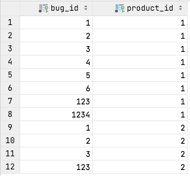

# Chapter 18. 스파게티 쿼리

- 예제: 우리가 작업하는 제품이 얼마나 되는지, 버그를 수정한 개발자가 몇 명인지, 개발자당 평균 몇 개의 버그를 수정하는지, 그리고 우리가 수정한 버그 중 고객이 보고한 게 얼마나 되는지
    
    ```sql
    SELECT COUNT(bp.product_id) AS how_many_products,
      COUNT(dev.account_id) AS how_many_developers,
      COUNT(b.bug_id)/COUNT(dev.account_id) AS avg_bugs_per_developer,
      COUNT(cust.account_id) AS how_many_customers
    FROM Bugs b JOIN BugsProducts bp ON (b.bug_id = bp.bug_id)
    JOIN Accounts dev ON (b.assigned_to = dev.account_id)
    JOIN Accounts cust ON (b.reported_by = cust.account_id)
    WHERE cust.email NOT LIKE '%@example.com'
    GROUP BY bp.product_id;
    +-------------------+---------------------+------------------------+--------------------+
    | how_many_products | how_many_developers | avg_bugs_per_developer | how_many_customers |
    +-------------------+---------------------+------------------------+--------------------+
    |                 8 |                   8 |                 1.0000 |                  8 |
    |                 4 |                   4 |                 1.0000 |                  4 |
    +-------------------+---------------------+------------------------+--------------------+
    ```
    
    - BugProducts
        
        
        

## 1. 목표: SQL 쿼리 줄이기

---

- SQL 프로그래머들이 일하면서 가장 흔하게 수렁에 빠지는 경우
    - 이걸 어떻게 하나의 쿼리로 할 수 있을까?
    - SQL 쿼리가 두 개면 두 배로 나쁘다고 생각한다.

## 2. 안티패턴: 복잡한 문제를 한 번에 풀기

---

### 의도하지 않은 제품

---

- 모든 결과를 하나의 쿼리로 만들어내려고 할 때 나타나는 흔한 결과 중 하나가 카테시안 곱
    - 카테시안 곱: 쿼리에 사용된 두 테이블에 이들의 관계를 제한하는 조건이 없을 때 발생
        
        ```sql
        -- OPEN:4, FIXED:3
        SELECT p.product_id,
          COUNT(f.bug_id) AS count_fixed,
          COUNT(o.bug_id) AS count_open
          FROM BugsProducts p
          JOIN Bugs f ON (p.bug_id = f.bug_id AND f.status = 'FIXED')
          JOIN BugsProducts p2 USING (product_id)
          JOIN Bugs o ON (p2.bug_id = o.bug_id AND o.status = 'OPEN')
         WHERE p.product_id = 1
         GROUP BY p.product_id;
        +------------+-------------+------------+
        | product_id | count_fixed | count_open |
        +------------+-------------+------------+
        |          1 |          12 |         12 |
        +------------+-------------+------------+
        -- SELECT p.product_id,
        --   COUNT(f.bug_id) AS count_fixed,
        --   COUNT(o.bug_id) AS count_open
        -- FROM BugsProducts p
        -- LEFT OUTER JOIN (select * from BugsProducts bpf CROSS JOIN Bugs f USING (bug_id)) f 
        --   ON (p.bug_id = f.bug_id AND f.status = 'FIXED')
        -- LEFT OUTER JOIN (select * from BugsProducts bpo CROSS JOIN Bugs o USING (bug_id)) o 
        --   ON (p.bug_id = o.bug_id AND o.status = 'OPEN')
        -- WHERE p.product_id = 1
        -- GROUP BY p.product_id;
        
        SELECT p.product_id, f.bug_id AS fixed, o.bug_id AS open
          FROM BugsProducts p
          JOIN Bugs f ON (p.bug_id = f.bug_id AND f.status = 'FIXED')
          JOIN BugsProducts p2 USING (product_id)
          JOIN Bugs o ON (p2.bug_id = o.bug_id AND o.status = 'OPEN')
         WHERE p.product_id = 1;
        +------------+-------+------+
        | product_id | fixed | open |
        +------------+-------+------+
        |          1 |     6 |    2 |
        |          1 |     5 |    2 |
        |          1 |     1 |    2 |
        |          1 |     6 |    3 |
        |          1 |     5 |    3 |
        |          1 |     1 |    3 |
        |          1 |     6 |    4 |
        |          1 |     5 |    4 |
        |          1 |     1 |    4 |
        |          1 |     6 |  123 |
        |          1 |     5 |  123 |
        |          1 |     1 |  123 |
        +------------+-------+------+
        ```
        
        
        
        18.1 FIXED 버그와 OPEN 버그의 카테시안 곱
        
    
    → 😰 한 쿼리로 여러 작업을 처리하려 할 때는 의도하지 않은 카테시안 곱을 생성하기 쉽다.
    

### 그래도 충분하지 않다면

---

- 😰 이런 쿼리는 잘못된 결과를 얻을 수 있을 뿐만 아니라, 작성하기도 어렵고, 수정하기도 어렵고, 디버깅하기도 어렵다.
- 😰 많은 조인과, 연관된 서브쿼리, 그리고 다른 연산을 사용해야 하는 복잡한 SQL 쿼리는 SQL 엔진이 빠르게 최적화하여 실행하기도 어렵다 👉 실행할 때의 비용
    - SQL 쿼리가 같은 복잡도를 가진다면 → 적은 수의 쿼리를 실행시켜야 성능이 더 좋을 것
    - 하나의 괴물 같은 쿼리가 실행되는데 드는 비용은 지수적으로 증가할 수 있다 → 여러 개의 단순한 쿼리를 사용하는 편이 훨씬 경제적이다.

## 3. 안티패턴 인식 방법

---

- “합계와 개수가 왜 이렇게 크지?”
    
    → 의도치 않은 카테시안 곱으로 데이터 집합이 뻥튀기됐다.
    
- “나는 하루 종일 이 괴물 같은 SQL 쿼리와 씨름했어”
    
    → 지나치게 긴 SQL쿼리와 씨름하고 있었다면, 접근방법을 재고해야 한다.
    
- “우리 데이터베이스 리포트에는 아무것도 추가할 수 없어. SQL쿼리가 어떻게 동작하는지 이해하려면 시간이 엄청나게 오래 걸릴 거야”
    
    → 아무도 손댈 수 없는 지나치게 복잡한 쿼리는 작성하지 말아야 한다.
    
- “쿼리에 DISTINCT를 하나 더 추가해봐”
    
    → 잘못된 쿼리의 증거는 감춰지지만, DBMS 는 중간 결과 집합을 생성해서 데이터를 정렬하고 중복을 제거하는 부가 작업을 하게 된다.
    

## 4. 안티패턴 사용이 합당한 경우

---

- 모든 결과를 정렬된 순서로 묶어서 봐야 하기 때문에, 하나의 쿼리로 복잡한 결과를 만들고 싶을 수도 있다.
    - 여러 개의 쿼리 결과를 모아 정렬하는 코드를 애플리케이션에서 직접 작성하는 것보다는 데이터베이스에 이런 일을 시키는 게 좀더 효율적일 수 있다.

## 5. 해법: 분할해서 정복하기

---

- Ockham's razor(검약률): 두 개의 이론이 동일한 예측을 한다면, 단순한 쪽이 좋은 이론이다.

### 한 번에 하나씩

---

- 의도하지 않은 카테시안 곱이 생기는 두 테이블 사이에 논리적 조인 조건을 찾을 수 없다면, 그런 조건이 아예 없기 때문일 수도 있다.
    - 카테시안 곱을 피하려면, 스파게티 쿼리를 단순한 여러 개의 쿼리로 나누어야 한다.
        
        ```sql
        SELECT p.product_id, COUNT(f.bug_id) AS count_fixed
          FROM BugsProducts p
          LEFT OUTER JOIN Bugs f ON (p.bug_id = f.bug_id AND f.status = 'FIXED')
         WHERE p.product_id = 1
         GROUP BY p.product_id;
        +------------+-------------+
        | product_id | count_fixed |
        +------------+-------------+
        |          1 |           3 |
        +------------+-------------+
        
        SELECT p.product_id, COUNT(o.bug_id) AS count_open
          FROM BugsProducts p
          LEFT OUTER JOIN Bugs o ON (p.bug_id = o.bug_id AND o.status = 'OPEN')
         WHERE p.product_id = 1
         GROUP BY p.product_id;
        +------------+------------+
        | product_id | count_open |
        +------------+------------+
        |          1 |          4 |
        +------------+------------+
        ```
        
- 개발과 유지보수, 성능에 대한 여러 가지 긍정적 효과
    - 카테시안 곱을 생성하지 않는다 → 쿼리가 정확한 결과를 보여준다는 확신을 쉽게 가질 수 있다.
    - 새로운 요구사항을 추가해야 하는 경우, 간단한 쿼리를 하나 추가하기가 더 쉽다.
    - SQL 엔진은 보통 복잡한 쿼리보다는 단순한 쿼리를 쉽게 최적화하고 실행할 수 있다 → 전체적으로는 이득
    - 코드 검토나 팀원 훈련 시간에, 복잡한 쿼리 하나를 설명하는 것보다는 간단한 쿼리 여러 개를 설명하는 것이 더 쉽다.

### `UNION` 연산

---

- `UNION` 연산을 사용하면 여러 쿼리의 결과를 하나의 결과 집합으로 묶을 수 있다.
    
    ```sql
    (SELECT p.product_id, f.status, COUNT(f.bug_id) AS bug_count
       FROM BugsProducts p
       LEFT OUTER JOIN Bugs f ON (p.bug_id = f.bug_id AND f.status = 'FIXED')
      WHERE p.product_id = 1
      GROUP BY p.product_id, f.status)
    
    UNION ALL
    
    (SELECT p.product_id, o.status, COUNT(o.bug_id) AS bug_count
       FROM BugsProducts p
       LEFT OUTER JOIN Bugs o ON (p.bug_id = o.bug_id AND o.status = 'OPEN')
      WHERE p.product_id = 1
      GROUP BY p.product_id, o.status)
    
    ORDER BY bug_count;
    +------------+--------+-----------+
    | product_id | status | bug_count |
    +------------+--------+-----------+
    |          1 | NULL   |         0 |
    |          1 | NULL   |         0 |
    |          1 | FIXED  |         3 |
    |          1 | OPEN   |         4 |
    +------------+--------+-----------+
    ```
    
- 각 서브쿼리의 결과를 구분할 수 있는 칼럼을 추가(ex> status)
- 서브쿼리의 칼럼이 호환될 때만 `UION` 연산을 사용할 수 있다.

### 상사의 문제 해결하기

---

- 가장 좋은 방법 👉 작업을 분리하는 것
    - 작업하는 제품 개수
        
        ```sql
        SELECT COUNT(*) AS how_many_products
          FROM Products;
        +-------------------+
        | how_many_products |
        +-------------------+
        |                 2 |
        +-------------------+
        ```
        
    - 버그를 수정한 개발자 수
        
        ```sql
        SELECT COUNT(DISTINCT assigned_to) AS how_many_developers
          FROM Bugs
         WHERE status = 'FIXED';
        +---------------------+
        | how_many_developers |
        +---------------------+
        |                   1 |
        +---------------------+
        ```
        
    - 개발자 당 편균 수정 버그 개수
        
        ```sql
        SELECT AVG(bugs_per_developer) AS average_bugs_per_developer
          FROM (SELECT dev.account_id, COUNT(*) AS bugs_per_developer
                  FROM Bugs b JOIN Accounts dev ON (b.assigned_to = dev.account_id)
                 WHERE b.status = 'FIXED'
                 GROUP BY dev.account_id) t;
        +----------------------------+
        | average_bugs_per_developer |
        +----------------------------+
        |                     3.0000 |
        +----------------------------+
        ```
        
    - 수정한 버그 중 고객이 보고한 것의 개수
        
        ```sql
        SELECT COUNT(*) AS how_many_customer_bugs
          FROM Bugs b JOIN Accounts cust ON (b.reported_by = cust.account_id)
         WHERE b.status = 'FIXED'
           AND cust.email NOT LIKE '%@example.com';
        +------------------------+
        | how_many_customer_bugs |
        +------------------------+
        |                      3 |
        +------------------------+
        ```
        

### SQL 을 이용한 SQL 자동 생성

---

- 조금씩 변하는 비슷한 쿼리가 많이 나올 수 있다 → 코드 생성을 적용할 좋은 기회!
    - 코드 생성: 새로운 코드를 출력하는 코드를 작성하는 기법
        
        ```sql
        SELECT CONCAT('UPDATE Inventory ',
          ' SET last_used = ''', MAX(u.usage_date), '''',
          ' WHERE inventory_id = ', u.inventory_id, ';') AS update_statement
          FROM ComputerUsage u
         GROUP BY u.inventory_id;
        ```
        
        
        

<aside>
💡 하나의 SQL 로 복잡한 문제를 풀 수 있을 것처럼 보이더라도, 확실치 못한 방법의 유혹에 넘어가면 안 된다.

</aside>

- 참고
    - [https://github.com/rewritech/til/blob/061e84726cb8a8f4efb0ebe09246c72b280bb6f7/SQL/SQL-antipatern-03쿼리.md](https://github.com/rewritech/til/blob/061e84726cb8a8f4efb0ebe09246c72b280bb6f7/SQL/SQL-antipatern-03%EC%BF%BC%EB%A6%AC.md)
    - [http://wiki.gurubee.net/pages/viewpage.action?pageId=15958097](http://wiki.gurubee.net/pages/viewpage.action?pageId=15958097)
